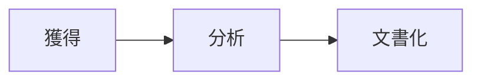
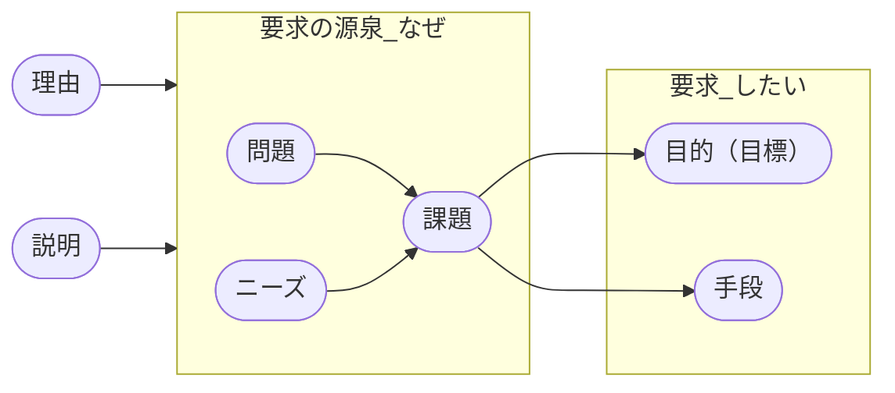
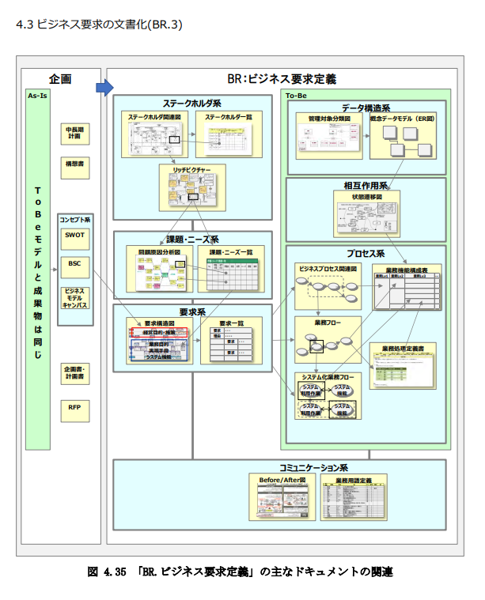

順に記述していくが、すべて*必要に応じて*であることを前提としている。

## BR. 1 ビジネス要求の獲得

### BR 1.1 現状把握

現行踏襲は要件定義ではない、現状を可視化することがスタート。

#### 解決したい問題

- *現行業務を把握するのが困難である*

- リバースエンジニアリング
- システム関連を把握
- 画面遷移
- 現行業務の整理、再学習
- 資料の発掘

方法はなんだろうか。上記に上げたことをどのように行うのか？ツールを使う、インタビューをする、操作をしながら記述をしていく、プロセス図をつくるなどが考えられるだろう。  

 

なぜ行うのだろうか？これは、次の「問題・課題」を抽出するためのインプットとなる。  

#### 解決したい課題

*分析した人以外誰も内容を把握できず、結果の整合が正しいかわからない*

これは次のような解決方法がある。

- 分析結果をプロジェクトメンバーでウォークスルーする
- 運用想定の人材を要件定義（分析）からアサインする

など考えられる。

### BR 1.2 問題・課題の抽出

#### 解決したい課題

*ステークホルダを見誤り必要な要求が抽出されない*

ステークホルダを漏らさないようにする。具体的にはレイヤーを意識  

- 経営層、事業部長
- マネージャ・リーダ
- 実務スタッフ

それぞれに別々の<b>関心事</b>があり、それぞれに対立がある。

リッチピクチャの作成の作成などひとつの手段になる

#### 解決したい課題

*真の問題・課題の抽出ができない*

問題・課題、目的・手段はそれぞれ違う。それを意識して把握する。  
これらの違いを意識しないことで、問題課題の把握が不十分だったことがある。USDMでは、要求に「説明」「理由」を追加することで真の要求を抽出しようとする。

関係としては次のようになる

問題とはあるべき理想とのギャップであり、課題とはその問題を解決するために行うべきこと、そしてその課題を実施することが対策である。  
<bt>
目的とは状態の変化を指す。「～を改善したい」「価値を上げたい」といった経営や業務で何らかの価値を上げたい、目指すところの結果等を指す。  
手段とは対策を実行可能な内容で定義したものを指す。「～を実施したい」「～を実行したい  

<bt>

要求は「～したい」と表現できる。「～を実施したい」と「～を達成したい」とあったとき、前者は手段の要求であり、後者は目的の要求である。  

さて、この要求はどのレベルか？これはビジネス要求である。真に実現したいものは何かを洗い出すためにこの区分けを行っている。このままシステムの要件にはならない。  

原因を見極めるにはなぜなぜ分析を行うとよい。そこで原因を把握したら、解決すべき課題を設定できる。

### BR 1.3 ゴール抽出

ゴールにはロールによる目的・目標がある。
- 経営レベル
- 業務レベル

それぞれの目的・目標を把握、見極めよう。要件定義では、経営レベルの目的をここで検討するのではない。それは企画でやることである。要件定義ではそれを確認、把握し、整理次へ向かう合意を行うことをする。  
 

つぎに、業務レベルの目的・目標を見極めよう。これには先に上げた目的・手段の違いを意識することも重要である。  
 
目的・目標も違う。目標は目的を達成するためのマイルストーンである。  

ここで行うことは、経営レベルの目的（目標）～業務レベルの目的（目標）をつなげていくことである。

### BR 1.4 手段抽出

#### 解決したい課題

*効果的な手段が抽出できない*

先に上げた手段、ということはどういうことか意識し、

- 目的を達成するための目的
- 目的を達成するための手段

の階層を意識する。  

目的を達成するために考えた手段は、その手段で十分なのか？目的の目的を分析、理由を喋るか、その手段を説明できるのか？確認しよう。遡っていけばもしかしたら別の手段を洗い出せるかもしれない。  
   

ことシステムの機能要件は「手段」の要求である。そのとき、本当にシステムで解決すべきところなのか、そうではないのか？「手段」はシステム化だけではない。業務自体の見直し、業務の運用の見直しでその「手段」を達成できないか？そしてその手段はなにか目的のためであるのでその目的を達成できるのか？考えていく。  

## B.R 2 ビジネス要求の分析  

### 2.1 要求の体系化

### 2.2 要求の具体化

### 2.3 優先順位付け

### 2.4 要求の交渉

## B.R 3 ビジネス要求の文書化 

### 3.1 ビジネス要求の文書化

