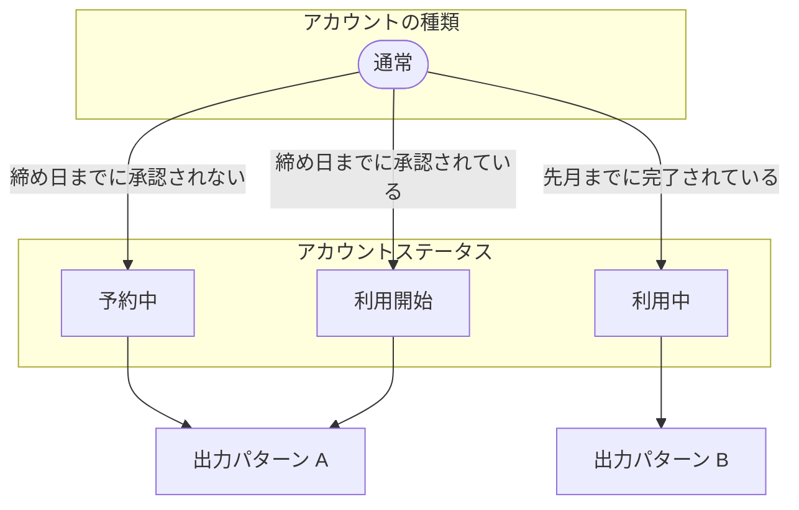

```mermaid
---
title: 
---
flowchart TD

subgraph アカウントの種類

A1([通常])
end

subgraph アカウントステータス

  S1[予約中]
  S2[利用開始]
  S3[利用中]

end

A1 -- 締め日までに承認されない--> S1
A1 -- 締め日までに承認されている --> S2
A1 -- 先月までに完了されている --> S3

S1 --> R1[出力パターン A]
S2 --> R1
S3 --> R2[出力パターン B]
```