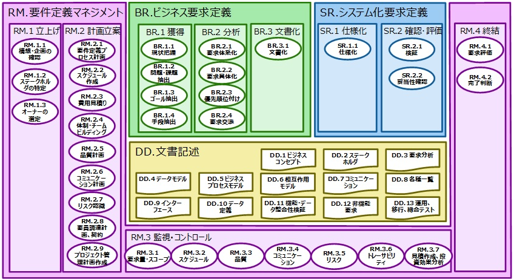
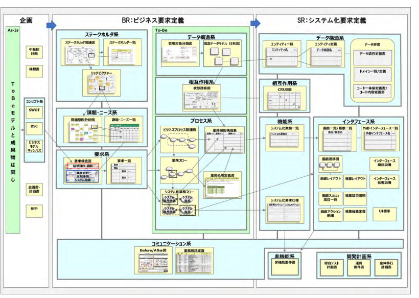

シラバスは次の通り。

[シラバス Ver5.2](https://www.ipa.go.jp/shiken/syllabus/nq6ept00000014gx-att/syllabus_sa_ver5_2.pdf)

これを見ると範囲としては、  


システム企画～開発・テストと上流から下流にわたり範囲のよう。  
ただし難関の午後Ⅱについては要件定義～システム設計あたりの論述がメインになりそう。  


シラバスでは RFPから書かれているが、期待する能力としては、以下のようにRFPに対して、

- 達成するための要件定義～ソリューションの説明をできる能力

とある。プロジェクトマネジメント自体の能力やRFPから提案書を書く主体としては範囲外と思われる。


```
RFPの準備~

・社内組織を調整する能力
・システム要件定義を行う能力
・取得のための選択肢を検討する能力
・取得計画を検討する能力
・受入れ基準を文書化する能力
・ビジネスモデルを実現する適切なソリュー
ションを選択する能力
・調達候補先を正しく選定する能力
・RFP に基づき目標，範囲，調達の必要条件
などを供給者に正しく説明する能力
```

## 要件定義の体系

IPAが「ユーザーのための要件定義ガイド」としてまとめてあるものを参考に<b>論述ができる能力をつけることを目標にする</b>

[ユーザのための要件定義ガイド 第2版 要件定義を成功に導く128の勘どころ 紹介ページ](https://www.ipa.go.jp/archive/publish/tn20191220.html)
[ガイドPDF](https://www.ipa.go.jp/archive/publish/qv6pgp0000000wrt-att/000079352.pdf)

以下は問題マップである。要件定義の作業としては、大きくはビジネス要求～システム要求を定義する。  



## 要件定義の文書体系

別途記述するが、それぞれのプロセスで目的を達成するために必要なものは次のようにカテゴリされている。  
文書をつくるのは目的ではない。

