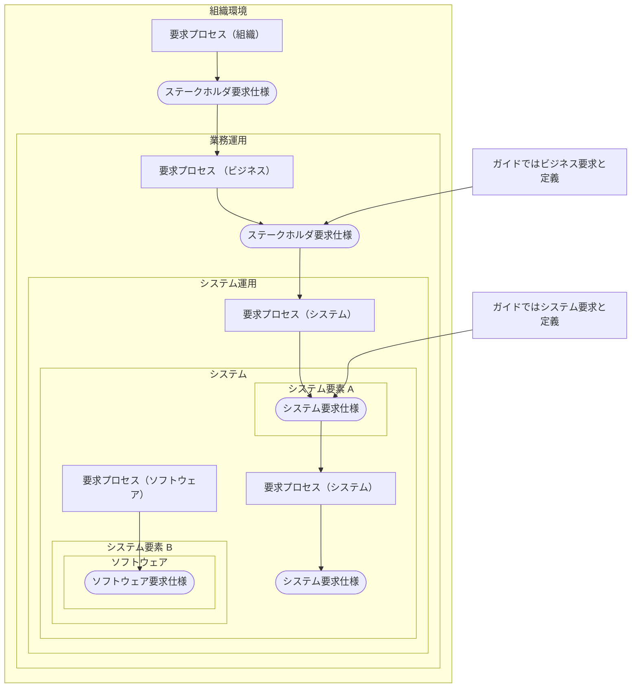

## 要件定義

なぜ必要があるのか？  
要件定義がないとそもそも何をするのかわからない。何を作る対象とするのかわからない。  
ただ作ったとしてもステークホルダが思うものと違う可能性がある。  

 

作ったあとに「それではない」ということも起こり得る。  
その手戻りを最小限とするため、また次の工程（設計～開発～）にスムーズに移行し、その作る理由のバイブルとするため、関係者感で合意を得たコミュニケーションの結果として必要なもの、それが要件定義プロセスであり、要件定義である。  

## 要求と要件の違い

英語ではどちらも「requirements」であり、明確な違いはない。ガイドでは要求を

- JIS X 166の要求事項と同義
- 要件は、要求を文書化、仕様化し、ステークホルダと合意したもの

としている。

## 要件定義の流れ

JIS X 166 では次の説明をしている。

これを IPA「ユーザーのための要件定義ガイド」（以降ガイド）では次の整理をしている。  

システムアーキテクトは、システムの包括的な知識経験を下にビジネスを分析でき、ステークホルダ、プロジェクトマネージャと円滑なコミュニケーションを取れ、道具として各種文書体系を把握し、説明、全体の合意を導ける能力を持つことがこの試験での範囲になる。  

要件定義はその一部である。  